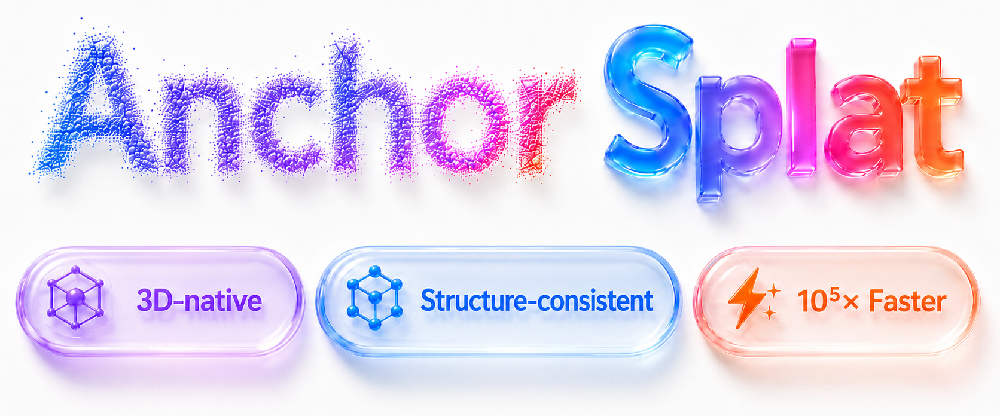

<p align="center">
  
</p>

<h1 align="center">Fast and Structure Consistent Detail Synthesis for Gaussian Splatting</h1>

<h3 align="center">ECCV 2026</h3>

<p align="center">
  <strong>Dexu Zhu</strong><sup>1,*</sup>,
  <strong>Jiangnan Shao</strong><sup>1,2,3,*</sup>,
  <strong>Xiaofeng Wang</strong><sup>2,4</sup>,
  <strong>Junxian Duan</strong><sup>1</sup>,
  <strong>Jie Cao</strong><sup>1,†</sup>,
  <strong>Zheng Zhu</strong><sup>2</sup>,
  <strong>Huaibo Huang</strong><sup>1</sup>
</p>

<p align="center">
  <sup>1</sup>MAIS&amp;NLPR, CASIA &nbsp;&nbsp;
  <sup>2</sup>GigaAI &nbsp;&nbsp;
  <sup>3</sup>ShanghaiTech University &nbsp;&nbsp;
  <sup>4</sup>Tsinghua University
</p>

<p align="center">
  <sup>*</sup> Equal contribution &nbsp;&nbsp; <sup>†</sup> Corresponding author &nbsp;&nbsp; 📧 <a href="mailto:dexu.zhu@cripac.ia.ac.cn">dexu.zhu@cripac.ia.ac.cn</a>
</p>

<p align="center">
  <strong>Fast</strong> · <strong>Generalizable</strong> · <strong>Plug-and-Play</strong>
</p>

<p align="center">
  <a href="https://arxiv.org/abs/2607.01290"></a>
  <a href="https://github.com/zhude233/AnchorSplat"></a>
  <a href="https://huggingface.co/de233/AnchorSplat"></a>
  <a href="https://huggingface.co/datasets/de233/AnchorSplat-Processed-Third-Party-Data"></a>
  <a href="#-resources"></a>
</p>

Official code release for **AnchorSplat**.

AnchorSplat is a fast, generalizable, and plug-and-play method for enhancing low-quality 3D Gaussian Splatting assets. Given only a coarse 3DGS model, it synthesizes detail-rich Gaussian primitives directly in 3D with a single network forward pass, avoiding the slow render-SR-reoptimize pipeline used by 2D-centric 3DGS super-resolution methods.

## ✨ Highlights

- ⚡ **Fast**: feed-forward 3D-native enhancement without per-scene optimization.
- 🌍 **Generalizable**: transfers to unseen 3DGS assets, including inputs with SH settings not seen during training.
- 🔌 **Plug-and-play**: supports external 3DGS PLY inputs with explicit normalization and coordinate restoration.
- 🎯 **Structure-consistent**: local point anchors keep generated details aligned with the input geometry.

## 🚀 Input / Output

AnchorSplat is **source-free** at inference time: it takes a low-quality 3DGS asset as input and does not require the original multi-view images.

| Item | Description |
| --- | --- |
| Input | A low-quality 3DGS asset. Benchmark evaluation uses a low-resolution gsplat checkpoint with COLMAP camera files; plug-and-play inference uses an Inria-style 3DGS PLY. |
| Target views | High-resolution images in the released evaluation packages are used only for metrics, never as model input. |
| Output | An enhanced 3DGS asset in the same coordinate frame as the input; evaluation scripts additionally save rendered comparisons and metrics. |
| 20x model | Generates 20 output Gaussians per input anchor for detail synthesis. |
| 1x model | Generates 1 output Gaussian per input anchor for lightweight refinement. |
| Normalization | Input Gaussian means are normalized to `[0, 1]^3` internally, scales are shifted by the same factor, and outputs are restored to the original coordinate frame. |

## 📈 Paper Results

Paper-reported results from the ECCV 2026 submission.

**3DGS-SR Dataset (1024 × 1024)**

| Method | Source-Free | PSNR | SSIM | LPIPS | Time |
| --- | :---: | ---: | ---: | ---: | ---: |
| 3DGS | - | 31.03 | 0.917 | 0.076 | - |
| Bicubic | ✗ | 34.36 | 0.923 | 0.064 | ~4m |
| SRGS | ✗ | 35.24 | 0.941 | 0.104 | ~16m |
| Sequence Matters | ✗ | 35.69 | 0.937 | 0.074 | ~34m |
| SuperGaussian | ✓ | 34.94 | 0.924 | 0.097 | ~41m |
| AnchorSplat | ✓ | 36.57 | 0.943 | 0.058 | ~0.01s |

**NeRF-Synthetic Dataset**

| Method | Source-Free | PSNR | SSIM | LPIPS | Time |
| --- | :---: | ---: | ---: | ---: | ---: |
| 3DGS | - | 23.30 | 0.872 | 0.114 | - |
| Bicubic | ✗ | 27.56 | 0.915 | 0.104 | ~4m |
| DiSR-NeRF | ✗ | 26.00 | 0.889 | 0.122 | ~30m |
| NeRF-SR | ✗ | 28.46 | 0.921 | 0.076 | ~24h |
| Gaussian-SR | ✗ | 28.37 | 0.924 | 0.087 | ~15m |
| SRGS | ✗ | 30.83 | 0.948 | 0.056 | ~18m |
| Sequence Matters | ✗ | 31.41 | 0.952 | 0.054 | ~40m |
| SuperGaussian | ✓ | 28.44 | 0.945 | 0.067 | ~45m |
| AnchorSplat | ✓ | 28.97 | 0.935 | 0.077 | ~0.01s |

**Ablation on 3DGS-SR**

| Method | PSNR | SSIM | LPIPS |
| --- | ---: | ---: | ---: |
| w/o Point Anchor | 26.79 | 0.886 | 0.186 |
| 1x points | 36.42 | 0.943 | 0.063 |
| 10x points | 36.51 | 0.944 | 0.060 |
| 20x points | 36.57 | 0.944 | 0.058 |

## 🔥 News

- ✅ **2026-07-02**: Release training code.
- ✅ **2026-07-02**: Release evaluation code.
- ✅ **2026-07-02**: Release inference code and demo.
- ✅ **2026-07-02**: Release paper PDF.
- ✅ **2026-07-03**: Release pretrained models.
- ✅ **2026-07-03**: Release processed third-party datasets (MVImgNet, NeRF-Synthetic).

## 📌 Release TODO

- ✅ Release training code
- ✅ Release evaluation code
- ✅ Release inference code and demo
- ✅ Release paper PDF
- ✅ Release pretrained models
- ✅ Release processed third-party datasets (MVImgNet, NeRF-Synthetic)
- ⬜ Release 3DGS-SR dataset
- ⬜ Release project page

## 🔗 Resources

| Resource | Link |
| --- | --- |
| Code | [GitHub](https://github.com/zhude233/AnchorSplat) |
| Paper | [arXiv](https://arxiv.org/abs/2607.01290) |
| Pretrained models | [Hugging Face](https://huggingface.co/de233/AnchorSplat) |
| Processed third-party datasets (MVImgNet, NeRF-Synthetic) | [Hugging Face](https://huggingface.co/datasets/de233/AnchorSplat-Processed-Third-Party-Data) |
| 3DGS-SR dataset | - |
| Project page | - |

## 🤗 Model Zoo

| Variant | Checkpoint | Output | Setting |
| --- | --- | --- | --- |
| 20x | [anchorsplat_20x.pth](https://huggingface.co/de233/AnchorSplat/blob/main/anchorsplat_20x.pth) | 20 Gaussians per input anchor | default |
| 1x | [anchorsplat_1x.pth](https://huggingface.co/de233/AnchorSplat/blob/main/anchorsplat_1x.pth) | 1 Gaussian per input anchor | `POINT_MULTIPLY_FACTOR=1` |

```bash
huggingface-cli download de233/AnchorSplat anchorsplat_20x.pth --local-dir checkpoints
huggingface-cli download de233/AnchorSplat anchorsplat_1x.pth --local-dir checkpoints
```

Use the 20x checkpoint for detail synthesis. Use the 1x checkpoint when you want a single refined Gaussian per input anchor or a lighter drop-in pass.

Important:

- 20x is the default configuration.
- 1x must be used with `POINT_MULTIPLY_FACTOR=1` or `--gin_param "FeaturePredictor.point_multiply_factor=1"`.
- A mismatched checkpoint and multiply factor will raise a strict weight shape error.
- 20x expands the Gaussian count by 20. Set `MAX_INPUT_GAUSSIANS` for very large inputs.
- Missing higher-order SH fields are padded with zeros, so SH-0/DC-only inputs are supported.

## 🛠️ Installation

The code is tested around PyTorch, CUDA extension packages, Pointcept, and gsplat. Exact wheels depend on your CUDA and PyTorch versions.

```bash
conda env create -f environment.yml
conda activate anchorsplat

# Point Transformer V3 backbone.
git clone https://github.com/Pointcept/Pointcept.git third_party/Pointcept
pip install -e third_party/Pointcept
```

If you prefer a manual installation:

```bash
conda create -n anchorsplat python=3.8 -y
conda activate anchorsplat
pip install torch==2.1.2 torchvision==0.16.2 --index-url https://download.pytorch.org/whl/cu118
pip install -r requirements.txt

# Point Transformer V3 backbone.
git clone https://github.com/Pointcept/Pointcept.git third_party/Pointcept
pip install -e third_party/Pointcept
```

If CUDA extension packages fail to install from `requirements.txt`, install versions that match your local PyTorch/CUDA build:

- `spconv-cu118` or the matching `spconv` wheel for your CUDA version
- `torch-scatter`, `torch-sparse`, `torch-cluster`, `torch-geometric`
- `fused-ssim`
- optional `flash-attn` if you keep `PointTransformerV3Model.enable_flash = True`

## ⚡ Inference On External PLY Files

AnchorSplat includes a lightweight inference path for Gaussian PLY files exported by LGM-style or Trellis-style pipelines.

Place the downloaded checkpoints under `checkpoints/`, or set `WEIGHTS` to a custom path.

```bash
# 20x detail synthesis.
WEIGHTS=checkpoints/anchorsplat_20x.pth \
bash scripts/inference_external.sh examples/lgm_sample.ply outputs/lgm_sample_refined.ply lgm

# 1x single-output refinement.
POINT_MULTIPLY_FACTOR=1 WEIGHTS=checkpoints/anchorsplat_1x.pth \
bash scripts/inference_external.sh examples/lgm_sample.ply outputs/lgm_sample_refined_1x.ply lgm

# Trellis-style PLY input.
WEIGHTS=checkpoints/anchorsplat_20x.pth \
bash scripts/inference_external.sh /path/to/trellis_output.ply outputs/trellis_refined.ply trellis
```

Use `NORMALIZATION=centered` for object-centric assets near the origin and `NORMALIZATION=bbox` for translated COLMAP/world-frame assets. The default `NORMALIZATION=auto` chooses between them from the input bounding box. If output scale or placement looks wrong for an external asset, rerun with `NORMALIZATION=bbox`.

Equivalent Python entry:

```bash
python inference_external.py \
  --weights checkpoints/anchorsplat_20x.pth \
  --input_ply examples/lgm_sample.ply \
  --output_ply outputs/lgm_sample_refined.ply \
  --model_type lgm \
  --normalization auto
```

For the 1x checkpoint:

```bash
python inference_external.py \
  --weights checkpoints/anchorsplat_1x.pth \
  --input_ply examples/lgm_sample.ply \
  --output_ply outputs/lgm_sample_refined_1x.ply \
  --model_type lgm \
  --normalization auto \
  --gin_param "FeaturePredictor.point_multiply_factor=1"
```

The PLY reader expects Inria-style 3DGS attributes: log-space `scale_*`, logit-space `opacity`, SH DC `f_dc_*`, optional `f_rest_*`, and quaternion `rot_*`. Coordinates are normalized internally to `[0, 1]^3`, scales are shifted by the same scalar factor, and the output is written back in the original input coordinate frame.

### Input Format

Required PLY fields:

```text
x, y, z
f_dc_0, f_dc_1, f_dc_2
opacity
scale_0, scale_1, scale_2
rot_0, rot_1, rot_2, rot_3
```

Optional higher-order SH fields are supported as `f_rest_0, f_rest_1, ...`. If absent, they are padded with zeros to match `FeaturePredictor.sh_degree = 3`, enabling plug-and-play inference on sources that only export RGB or SH DC features.

Attribute conventions:

- `scale_0..2`: log-space Gaussian scales. If you have positive scales `sigma`, write `log(sigma)`.
- `opacity`: logit-space opacity. If you have alpha in `[0, 1]`, write `log(alpha / (1 - alpha))` after clamping alpha away from 0 and 1.
- `f_dc_0..2`: SH DC coefficients. If you have RGB in `[0, 1]`, convert with `f_dc = (rgb - 0.5) / 0.28209479177387814`.
- `f_rest_*`: flattened non-DC SH coefficients in the common Inria 3DGS order.

Coordinate normalization:

```text
means_norm = means * s + t
scales_norm = log_scales + log(s)
means_out = (means_norm_out - t) / s
log_scales_out = scales_norm_out - log(s)
```

The output PLY is written back in the same coordinate frame as the input.

### Sanity Check

```bash
bash scripts/inference_external.sh examples/lgm_sample.ply outputs/release_check/lgm_sample_20x.ply lgm

POINT_MULTIPLY_FACTOR=1 WEIGHTS=checkpoints/anchorsplat_1x.pth \
bash scripts/inference_external.sh examples/lgm_sample.ply outputs/release_check/lgm_sample_1x.ply lgm
```

The demo input has 2048 Gaussians. The expected outputs are 40960 Gaussians for 20x and 2048 Gaussians for 1x.

## 🗂️ Dataset Layout

Training expects each scene to contain a low-resolution input 3DGS checkpoint and high-resolution target views:

```text
data/3dgs-sr/train/<scene_name>/
  256/
    gaussian_splatting/
      ckpts/
        ckpt_14999_rank0.pt
    sparse/0/
      cameras.bin
      images.bin
      points3D.bin
  1024/
    images/
    cameras.txt
    images.txt

data/3dgs-sr/test/<scene_name>/
  ...
```

The defaults are configured in `configs/dataset/objaverse.gin`:

```gin
GaussianSceneDataset.low_resolution = 256
GaussianSceneDataset.high_resolution = 1024
GaussianSceneDataset.input_ckpt_step = 14999
train_dataset/GaussianSceneDataset.dataset_folder = 'data/3dgs-sr/train'
test_dataset/GaussianSceneDataset.dataset_folder = 'data/3dgs-sr/test'
```

## 🏋️ Training

The main training script is DDP-based. The default script launches 8 processes:

```bash
bash scripts/train_anchorsplat.sh
```

Common overrides:

```bash
GPUS=0 NPROC=1 ACCUMULATE_STEP=8 OUTPUT_DIR=outputs/anchorsplat_20x_single_gpu \
bash scripts/train_anchorsplat.sh
```

Set `POINT_MULTIPLY_FACTOR=1` to train the single-output variant.

The core model settings are in `configs/model/ptv3.gin`:

```gin
FeaturePredictor.point_multiply_factor = 20
FeaturePredictor.anchor_offset_scale = 0.015
FeaturePredictor.predict_double_features = True
```

The default W&B mode is disabled for open-source runs. Enable online logging with:

```bash
python train.py --disable_wandb=false ...
```

## 📊 Evaluation

Evaluation requires the processed test set under `data/3dgs-sr/test` or a custom path set through Gin. Run evaluation with the matching checkpoint and multiply factor:

```bash
CHECKPOINT=checkpoints/anchorsplat_20x.pth \
GPUS=0 NPROC=1 \
bash scripts/evaluate_anchorsplat.sh

POINT_MULTIPLY_FACTOR=1 CHECKPOINT=checkpoints/anchorsplat_1x.pth \
GPUS=0 NPROC=1 OUTPUT_DIR=outputs/eval_anchorsplat_1x \
bash scripts/evaluate_anchorsplat.sh
```

Outputs are written under `outputs/` and include rendered comparisons, per-rank metric files, and an evaluation log.

### MVImgNet Zero-Shot Evaluation

The MVImgNet numbers in the ECCV 2026 rebuttal use the processed third-party split named `mvimgnet_supergaussian_4x_downsampled_lr`.

```bash
mkdir -p data/downloads
huggingface-cli download de233/AnchorSplat-Processed-Third-Party-Data \
  mvimgnet_supergaussian_4x_downsampled_lr.tar.zst \
  --repo-type dataset \
  --local-dir data/downloads

mkdir -p data
tar --zstd -xf data/downloads/mvimgnet_supergaussian_4x_downsampled_lr.tar.zst -C data
```

Then run:

```bash
CHECKPOINT=checkpoints/anchorsplat_20x.pth \
DATA_CONFIG=configs/dataset/mvimgnet_supergaussian_4x_downsampled_lr.gin \
GPUS=0 NPROC=1 OUTPUT_DIR=outputs/eval_mvimgnet_20x \
bash scripts/evaluate_anchorsplat.sh

POINT_MULTIPLY_FACTOR=1 CHECKPOINT=checkpoints/anchorsplat_1x.pth \
DATA_CONFIG=configs/dataset/mvimgnet_supergaussian_4x_downsampled_lr.gin \
GPUS=0 NPROC=1 OUTPUT_DIR=outputs/eval_mvimgnet_1x \
bash scripts/evaluate_anchorsplat.sh
```

Reported metrics on 15 held-out MVImgNet scenes:

| Method | Budget | PSNR | SSIM | LPIPS |
| --- | ---: | ---: | ---: | ---: |
| 3DGS input | 71.4K | 22.19 | 0.732 | 0.241 |
| AnchorSplat-1x | 71.4K | 26.42 | 0.847 | 0.199 |
| AnchorSplat-20x | 1.43M | 27.36 | 0.862 | 0.192 |

Small last-digit differences can appear across CUDA/gsplat environments.

The ordinary SuperGaussian 4x processed input is a different package and does not reproduce this rebuttal table.

### NeRF-Synthetic Zero-Shot Evaluation

The ECCV 2026 NeRF-Synthetic evaluation uses the non-sparse package named `nerf_synthetic_lowres_3dgs`.

```bash
mkdir -p data/downloads
huggingface-cli download de233/AnchorSplat-Processed-Third-Party-Data \
  nerf_synthetic_lowres_3dgs.tar.zst \
  --repo-type dataset \
  --local-dir data/downloads

mkdir -p data
tar --zstd -xf data/downloads/nerf_synthetic_lowres_3dgs.tar.zst -C data
```

Then run:

```bash
CHECKPOINT=checkpoints/anchorsplat_20x.pth \
DATA_CONFIG=configs/dataset/nerf_synthetic_lowres_3dgs.gin \
GPUS=0 NPROC=1 OUTPUT_DIR=outputs/eval_nerf_synthetic_20x \
bash scripts/evaluate_anchorsplat.sh

POINT_MULTIPLY_FACTOR=1 CHECKPOINT=checkpoints/anchorsplat_1x.pth \
DATA_CONFIG=configs/dataset/nerf_synthetic_lowres_3dgs.gin \
GPUS=0 NPROC=1 OUTPUT_DIR=outputs/eval_nerf_synthetic_1x \
bash scripts/evaluate_anchorsplat.sh
```

Verified metrics on 8 NeRF-Synthetic scenes:

| Method | PSNR | SSIM | LPIPS |
| --- | ---: | ---: | ---: |
| 3DGS input | 23.31 | 0.873 | 0.097 |
| AnchorSplat-1x | 28.36 | 0.932 | 0.085 |
| AnchorSplat-20x | 28.72 | 0.935 | 0.073 |

Use this non-sparse package for the NeRF-Synthetic setting. Sparse or bicubic NeRF folders are different baselines and should not be used as AnchorSplat inputs for this evaluation.

## 🧰 Dataset Preparation Tools

The `tools/` directory contains helper scripts used during internal data conversion and low-resolution 3DGS preparation:

- `tools/convert_3dgs_ply_to_gsplat_ckpt.py`
- `tools/prepare_mvimgnet_layout.py`
- `tools/train_mvimgnet_3dgs.sh`
- `tools/prepare_mvimgnet_lowres_3dgs.py`
- `tools/train_mvimgnet_lowres_3dgs.sh`
- `tools/rewrite_colmap_bins_legacy.py`

These tools use relative defaults under `data/` and `third_party/`. Some require external projects such as gsplat, COLMAP preprocessing scripts, or SuperGaussian. Keep those dependencies outside git, for example under `third_party/`.

## 🧭 Repository Structure

```text
configs/              Gin configs for data, model, and training
dataset/              3DGS dataset loading and COLMAP utilities
models/               AnchorSplat predictor and Point Transformer V3 wrapper
scripts/              Main train, eval, and external inference launchers
tools/                Dataset conversion and preprocessing utilities
utils/                Rendering, losses, metrics, logging, and optimizers
train.py              DDP training and evaluation entrypoint
inference_external.py External PLY inference entrypoint
```

## 🙏 Acknowledgements

This code builds on ideas and components from SplatFormer, Pointcept, gsplat, PyTorch Geometric, and 3D Gaussian Splatting tooling. Please also follow the licenses of all third-party dependencies you install locally.

## 📄 License

This repository is released under the MIT License. Third-party dependencies and datasets retain their original licenses.

## 📚 Citation

If you find AnchorSplat useful for your research, please consider citing:

```bibtex
@article{zhu2026anchorsplat,
  title={AnchorSplat: Fast and Structure Consistent Detail Synthesis for Gaussian Splatting},
  author={Zhu, Dexu and Shao, Jiangnan and Wang, Xiaofeng and Duan, Junxian and Cao, Jie and Zhu, Zheng and Huang, Huaibo},
  journal={arXiv preprint arXiv:2607.01290},
  year={2026},
  eprint={2607.01290},
  archivePrefix={arXiv},
  primaryClass={cs.CV},
  doi={10.48550/arXiv.2607.01290},
  url={https://arxiv.org/abs/2607.01290}
}
```
